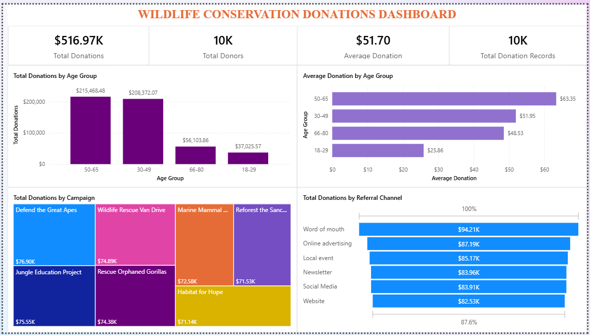
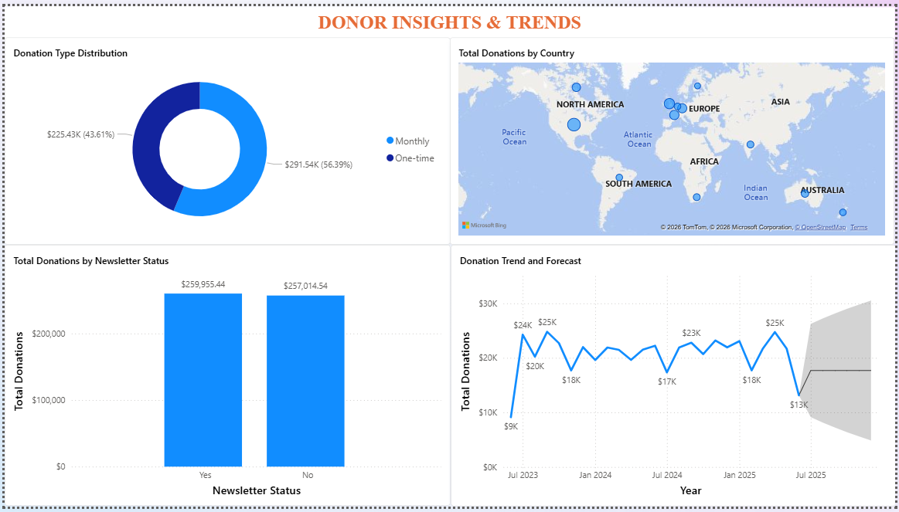

# 🐾 Wildlife Conservation Donation Analysis

> A data-driven analysis of donor behavior, campaign effectiveness, and revenue stability in nonprofit fundraising.

---

## 📌 Overview
This project analyzes donation data from a wildlife conservation organization to understand the key drivers of fundraising performance.

The analysis focuses on donor segmentation, campaign effectiveness, acquisition channels, and time-based trends to uncover actionable insights for improving revenue stability and growth.

---

## 🎯 Business Problem
Wildlife conservation charities rely heavily on donations, but often lack visibility into what drives fundraising success.

Key challenges include:
- Identifying high-value donor segments  
- Understanding which campaigns and channels generate the most revenue  
- Evaluating whether engagement strategies influence donor behavior  
- Monitoring donation trends over time  
- Forecasting future fundraising performance  

Without these insights, fundraising decisions remain reactive and limit growth potential.

---

## 📊 Dashboard Preview

### 📈 Overview Dashboard

### 👥 Donor Insights & Trends

---

## 🧠 Key Insights

- Older donors (ages 50–65) contribute the highest total and average donation values, indicating a concentration of financial capacity in this segment :contentReference[oaicite:1]{index=1}  
- One-time donations dominate, highlighting reliance on irregular revenue streams and limited adoption of recurring giving :contentReference[oaicite:2]{index=2}  
- Word-of-mouth and online advertising are the most effective acquisition channels, driving the highest donation values :contentReference[oaicite:3]{index=3}  
- Campaign contributions are relatively balanced, suggesting diversification but no clear high-performing campaign  
- Newsletter engagement shows minimal impact on donation behavior, indicating ineffective conversion strategies  
- Donation trends remain stable with limited growth, suggesting strong retention but weak expansion  

---

## 🛠 Methodology

- Data cleaning and transformation using Power Query  
- Feature engineering (time variables, donor segmentation, engagement labels)  
- Exploratory Data Analysis (EDA)  
- Segmentation analysis (donor groups)  
- Channel and funnel analysis  
- Time series analysis and forecasting  

---

## 📈 Business Recommendations

- Introduce recurring donation programs to improve revenue stability  
- Target high-value donor segments (ages 50–65) with tailored campaigns  
- Reallocate resources to high-performing channels (word-of-mouth, digital ads)  
- Redesign engagement strategies to improve conversion  
- Scale successful campaign strategies across fundraising initiatives  
- Introduce growth-focused acquisition strategies  

---

## 🛠 Tools Used
- Power BI (data modeling, DAX, visualization, forecasting)  
- Power Query (data cleaning and transformation)  
- Data Analysis (EDA, segmentation, time series analysis)  

---

## 📊 Data Source
This project uses publicly available data from Kaggle for analytical purposes.

- Source: [here](https://www.kaggle.com/datasets/jaderz/synthetic-animal-charity-donations/data)

---

## 📁 Files Included
- Wildlife Donation Analysis Report (PDF)  
- Dataset  

---

## 💡 Key Takeaway
Fundraising performance is driven by a combination of donor segmentation, channel effectiveness, and engagement strategy with significant opportunities to improve stability through recurring donation models.

---

⭐️ *Using data to uncover insights that drive better decisions.*
